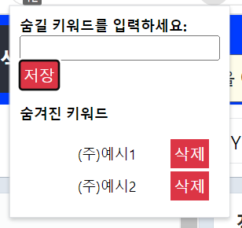
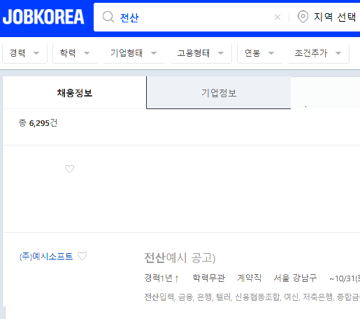

## 목적

구인구직 사이트에서 내가 보고 싶지 않은 공고를 숨긴다.

## 결과

### 1. 익스텐션

### 2. 적용 예시

## 작업

### 1. 단계별 작업

- [x] 작업 1. 크롬 익스텐션을 적용하는 방법을 조사
- [x] 작업 2. 공고를 숨기려면 어떻게 하면 되는지 분석

### 2. 완료 작업

- [x] 작업 1. 유저로부터 제외하고 싶은 공고 데이터를 가져와야하지만 가져오기 전에 테스트 데이터로 진행
- [x] 작업 2. 제거 대상의 웹 소스를 분석하여 DOM을 가져옴
- [x] 작업 3. 가져온 DOM을 수정하여 텍스트 색상을 white로 변경
- [x] 작업 4. 유저로부터 데이터를 입력 받음
- [x] 작업 5. 유저로부터 입력받은 데이터를 저장
- [x] 작업 6. 유저가 데이터를 삭제할 수 있는 기능 제공
- [x] 작업 7. 키워드를 추가할 때 페이지에 반영
- [x] 작업 9. 아이콘을 클릭해야 적용되던 것을 수정하여 페이지에 방문하고 바로 적용되도록 수정
- [x] 작업 10. 등록된 키워드에 mouseover하면 원래 키워드가 나온다.
- [x] 작업 8. 키워드를 삭제할 때 페이지에 반영
- [x] 작업 11. 지원 버튼도 흐리게 표시

### 3. 해야할 작업

- [ ] 작업 마지막. 익스텐션 업로드

## 참고

- [스크립트간 관계](https://plainenglish.io/blog/how-to-send-data-between-chrome-extension-scripts-1182ce67b659)
